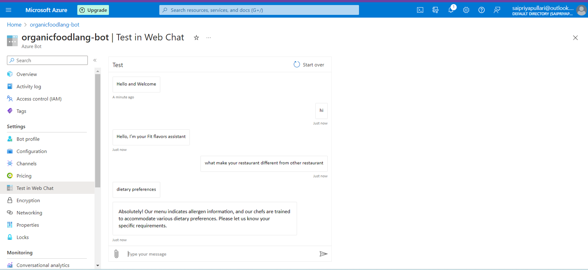
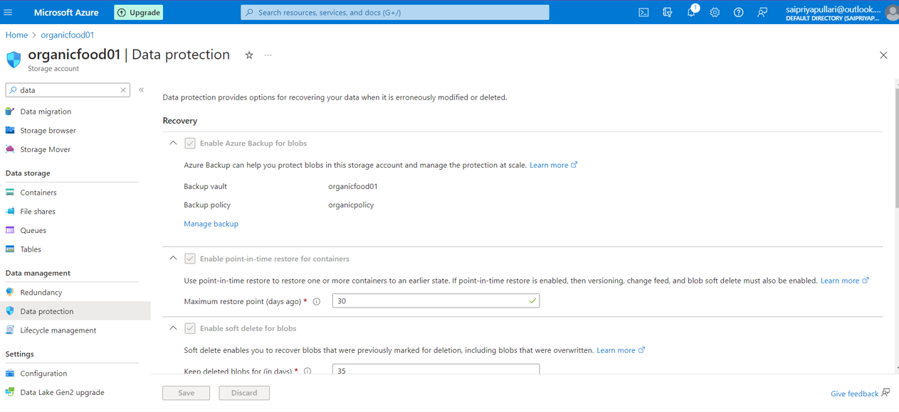
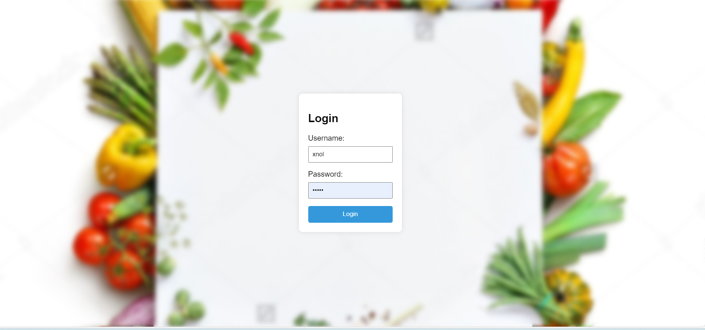
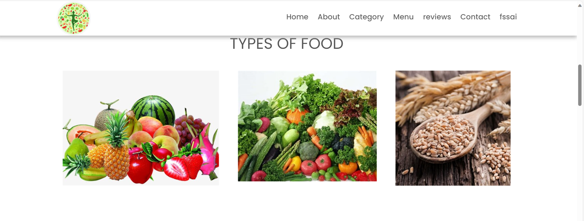
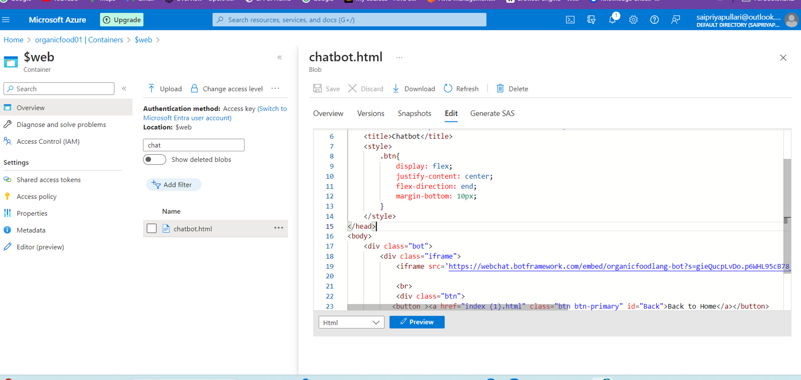

<h1>FIT-FLAVOURS KITCHEN:</h1>
<h4>Savor the Goodness of nature in every bite.</h4>
<h1>Project Details</h1>
	<b>**Project Demo URL:https://organicfood01.z13.web.core.windows.net/</b>  
	<b>**Demo Video URL:https://youtu.be/E_F4iWolFHM?si=fOvTiH1zMGz4bOwo</b>  
	<b>GitHub Repository URL :https://github.com/Sikindar000/FIT-FLAVOURSKITCHEN</b> 
	<b>Industry : Life Style</b> 

<h1>Roles & Responsibilities:</h2>
<b>Sai Priya (content management): Responsible for managing the website content.</b>  
<b>Mysakshi Ranjith (project description): Responsible for managing the description.</b>  
<b>Modukuri Rajesh (documentation): Responsible for managing the documentation process.</b>  
<b>Kamatham Sikinder Basha (deployment): Deployment and maintenance of project infrastructure.</b> 

<h1>Azure services used:</h1>
<b>1.Azure blob storage</b>
 
<b>2.Storage account</b>  
 
<b>3.Azure Backup service</b>
 
<b> 4.Azure App service plan<b> 
<b>5.Azure AI services</b> 
 
<b>6.chatbot</b>  
<h1>Problem Statement:</h1>

Today’s restaurant faces challenges ranging from the use of processed ingredients to a lack of emphasis on organic and locally sourced produce. The menu lacks freshness and nutritional diversity, leading to concerns about the overall health impact on customers. Additionally, the reliance on industrial farming practices raises sustainability issues and environmental concerns. Limited transparency about ingredient sources and preparation methods further erodes customer trust. The absence of innovative culinary approaches and inflexible menu options contributes to a stagnant dining experience. This restaurant struggles to adapt to evolving consumer preferences for organic, sustainable, and locally produced foods, risking its relevance in a health-conscious market."

<h1>Project Description:</h1>

 This project involves the creation of a  static and visually appealing website for an organic restaurant. The website aims to showcase the restaurant's commitment to organic, pesticide-free ingredients, with a focus on both vegetarian and non-vegetarian offerings. The goal is to attract health-conscious customers by highlighting the wholesome, natural options available and promoting environmental consciousness.

<h1>Core Azure Services:</h1>
<h3>Azure Blob Storage:-</h3>

Azure Blob Storage is Microsoft's scalable object storage solution in the Azure cloud. It enables secure and cost-effective storage of unstructured data, such as documents and images. Offering seamless integration with applications, it supports data of any size and optimizes accessibility through a globally distributed network.
 

<h3>Azure Storage Account:-</h3> 

Azure Storage Account is a foundational component in Microsoft Azure, providing secure and scalable cloud storage. It supports various storage services like Blob, File, Queue, and Table, accommodating diverse data types. With features such as redundancy options and access controls, it ensures reliable and efficient data management.

 <h3>Azure Backup Service:-</h3> 
 
Azure Backup Service by Microsoft safeguards critical data in the Azure cloud. It offers automated and scalable backup solutions for virtual machines, applications, and files. With features like long-term retention and geo-redundancy, it ensures data resilience and facilitates efficient disaster recovery, enhancing overall data protection strategies.

 
 <h1>Manage Identity</h1>
 
Azure Managed Identity is a service in Microsoft Azure that enhances the security and ease of access to cloud resources by providing an identity management solution for applications and services.

 
 
 <h1>App Service plan</h1>
 

Azure App Service Plan is a foundational component within Microsoft Azure that defines the region, compute resources, and features available to host web applications, mobile app backends, and RESTful APIs using Azure App Service.
 

 
<h1>Azure AI Service</h1>
<h3>bot service<h3>

Azure Bot Service is a cloud-based service provided by Microsoft Azure that enables the development, deployment, and management of intelligent bots. Bots created using Azure Bot Service can interact with users across various channels, such as web, mobile, Microsoft Teams, Skype, and more.

<h3>Search Service</h3>

Azure Search Service is a fully managed, cloud-based search-as-a-service solution provided by Microsoft Azure. It allows developers to integrate powerful search capabilities into their applications without the need for complex infrastructure or extensive search engine expertise.

<h3>Azure Chatbot :-</h3> 

The Azure AI Language Chatbot is a cutting-edge conversational agent powered by Microsoft's Azure platform. Leveraging advanced natural language processing capabilities, it facilitates dynamic and context-aware interactions. This intelligent chatbot employs machine learning algorithms to comprehend user queries, providing personalized responses and assistance across diverse domains. Seamlessly integrating with Azure services, it ensures scalability and reliability.

<h1>Screenshot’s:</h1>
<h3>Static website</h3>

<h1>Language service</h1>

<h1> Data protection</h1>

<h1>Description</h1>
<h1>Here I am attaching the final working website's screenshot for the reference.
Working Live Project Display:</h1>

<h3>chatbot</h3>

<h3>Resourace Visualizer</h3>

<h1>Final Project Statement:</h1>
This website project aims to not only present the restaurant's menu but also educate and engage visitors on the benefits of organic dining and sustainable practices. It will serve as a digital platform that reflects the values of the organic restaurant, attracting a diverse clientele seeking a health-conscious and environmentally responsible dining experience.
